# Easy Bug Manager User manual

Time：2020.02.05

By : XuDaWang

Translation: Google Translate  (Chinese-> English)

<br/>

<br/>

## Foreword

<br/>


<br/>

Because most of the work in this software is done by one person, the software may have defects or can be improved.

If you have any suggestions or want to submit a bug in the software, please contact me via email : [xudawang@vip.163.com](xudawang@vip.163.com)

In order to make the software better, we have open sourced this software, you can view the source code of this software on Github : https://github.com/xujiangjiang/Easy-Bug-Manager

Thank you for using this little software, thank you very much again : )

<br/>

<br/>

<br/>

<br/>

## Table of Contents

[toc]

<br/>

<br/>

<br/>

<br/>

## Download

Steam store : https://store.steampowered.com/app/1175080/Easy_Bug_Manager/

Github : https://github.com/xujiangjiang/Easy-Bug-Manager

<br/>

<br/>

<br/>

<br/>

## Introduction


<br/>

<u>**Introduction**</u>

```
Easy Bug Manager is a tool for bug management.
```

If you're developing a software, web page, or game, Easy Bug Manager is your best choice to help you manage bugs in your project.
If you're not a developer, you can also use our product as a simple and cute To-do software. It helps you record and manage what you need to do.
If you are an artist, you can also use our software to help you manage your ideas.

<br/>

<u>**Features**</u>

- For free
- Export Excel file
- Two kinds of Themes： Light and Dark
- Two kinds of Languages：English and Chinese
- Simple and easy to use
- Lovely and concise interface
- Designed for individuals or small groups
- A bug be with you ,talk with you

<br/>

<u>**What are the functions of this software?**</u>

It can record and manage bugs in your project.
Step 1: Enter the description of the bug
Step 2: Set the priority of the bug
Step 3: Let’s kill bugs one by one according to the priority!

<br/>

**<u>If you're a programmer</u>**

You can record all bugs in this software and assign priority and schedule for each bug.
Compared with other same type software, our product has the following merits:

- Lovely interface, simple operation.
- In the design of the software, only really useful elements were remained. You do not have to fill in lots of options, but just fill in the name and priority of the bug. Then you can record a bug.
- You do not have to consider for too much. Just simply record the bug, and then solve it.
- To make boring things warm , "Polar Bear Debugging" was added in the software (it is inspired by "Rubber Duck Debugging"). You can type in your thoughts on the bug as if you were chatting with a friend, then the Bug will reply you with its thoughts and encouragement. With friendly chat, your train of thought will be clearer! Isn't it great to debug with chat?

<br/>

**<u>If you're not a programmer</u>**

You can use this software as a To-do software.
Step 1: Enter the things you’re going to do.
Step 2: Set priorities.
Step 3: Let’s get things done one by one according to priorities!
<br/>

**<u>If you're an artist</u>**

If you are an artist, you can also use this software to help you manage your ideas.
Step 1: Enter an idea.
Step 2: Take your time, perfect your idea.
Step 3: Use your idea.

<br/>

<br/>

<br/>

<br/>

## Create project

You can store a lot of Bugs in a project.

If you want to manage your bugs, then you first need to create a project file.

How can I create a project file  `(.bugs file)` ?

<br/>

**Step 1 : **After opening the software, click the [Create] button.

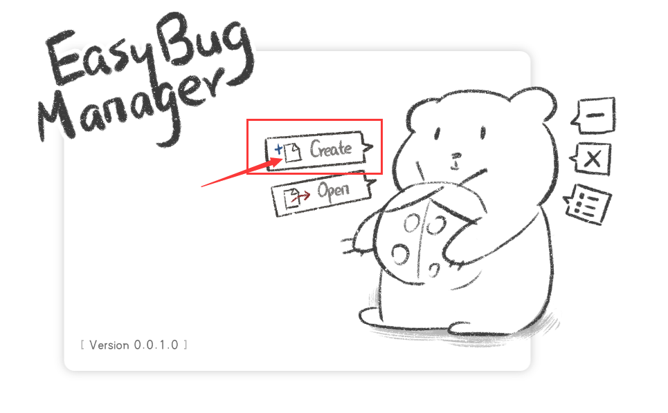

<br/>

**Step 2 : **Enter a name for the project and choose the folder where you want to save the project file.


<br/>

**Step 3 :  **Click the [OK] button and a project is created!

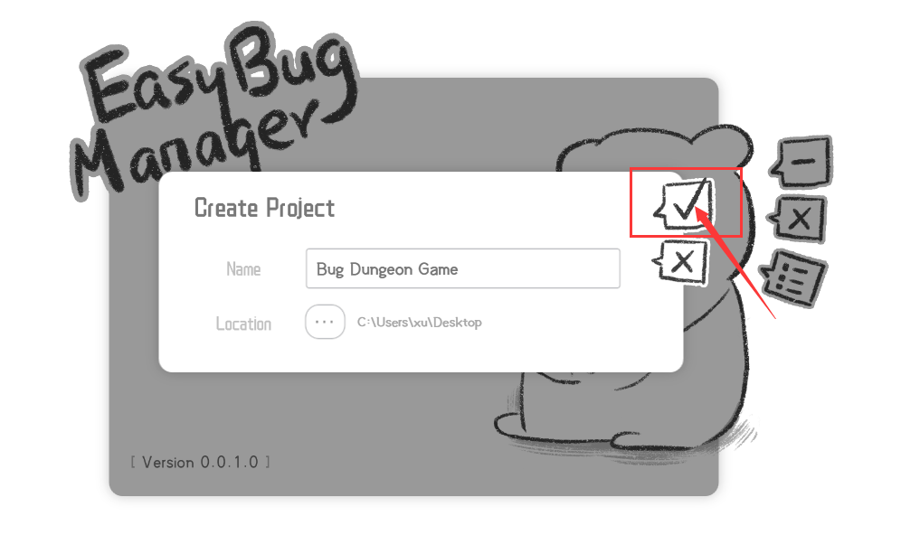

<br/>

**Step 4 : ** After the project is created, the software will automatically open the project. 

​			    And the software will automatically create a project file in the folder you specified.

```
 (If you want to know more about the "Project File", you can check the [Project File] section later)
```

​		

<br/>

<br/>

<br/>

<br/>

## Open project

If you already have a project file, how can you open this project file?

<br/>

**Step 1 : ** After opening the software, click the [Open] button.


<br/>

**Step 2 : ** Then select the project file `(.bugs file)` you want to open, and then click the [Open] button.

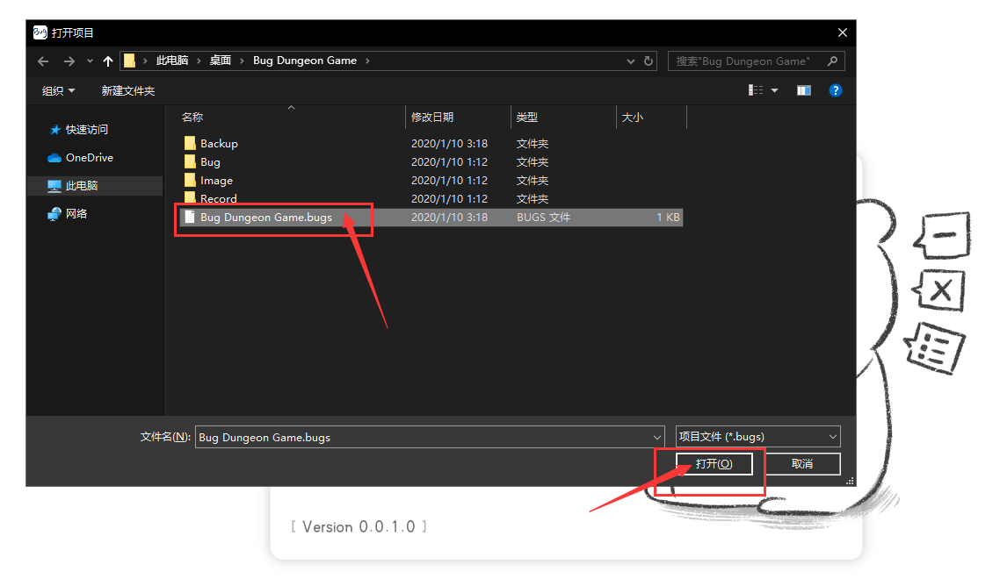

<br/>

**Step 3 : ** This way, the software will open this project ~


<br/>

<br/>

<br/>

<br/>

## Create Bug

Now that our project is empty, let's create some bugs in it! ~

So how can we create a bug  `(record a bug)`  in the project?

<br/>

**Step 1 : ** Click the [Add] button in the interface.

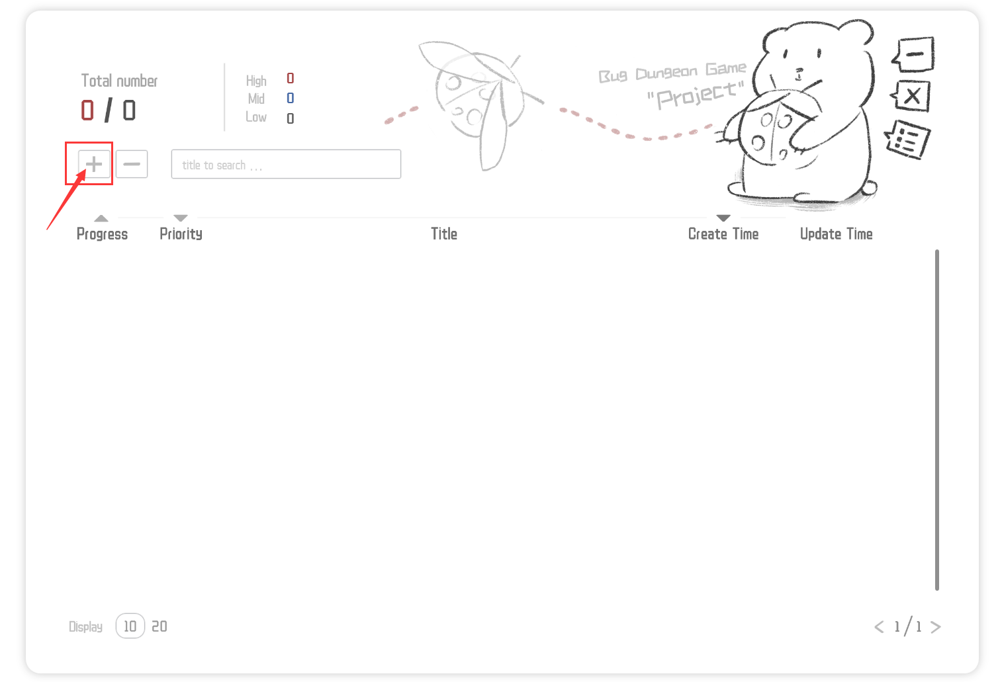

<br/>

**Step 2 : ** Enter the name and the priority of the bug.


<br/>

**Step 3 : ** Click the [OK] button.

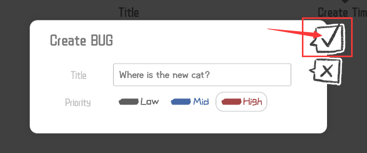

<br/>

**Step 4 : ** This way, a bug is created!

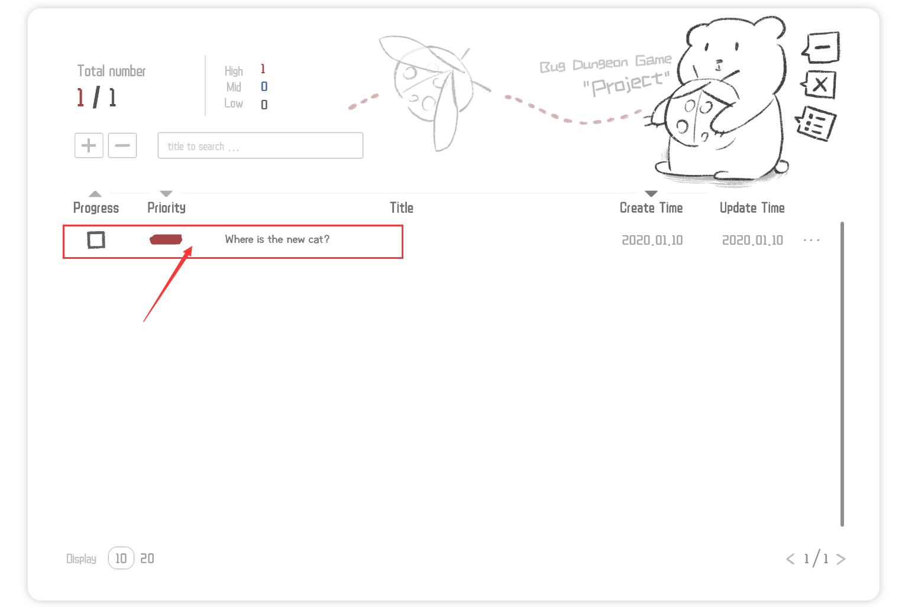

<br/>

<br/>

<br/>

<br/>

## Remove Bug

How can we delete a bug?

<br/>

**Step 1 : ** Click on the bug you want to delete


<br/>

**Step 2 : ** Click the [Delete] button

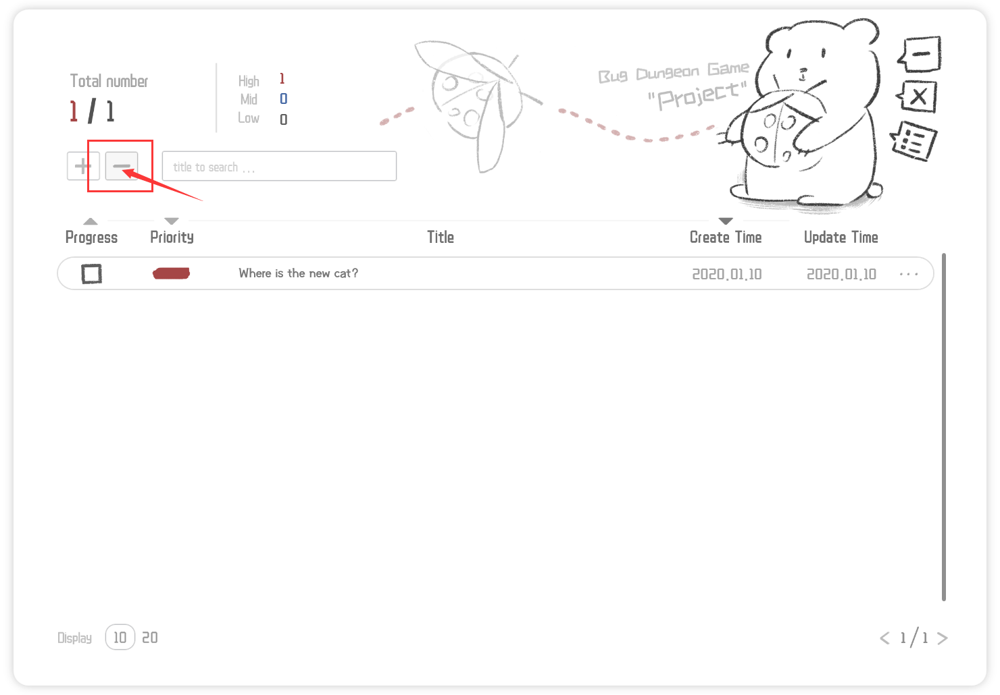

<br/>

**Step 3 : ** Then click [OK to delete] button, this bug will be deleted!


<br/>

<br/>

<br/>

<br/>

## Change Bug

You can change the title, progress, and priority of a bug at any time.

*( There are many ways to change the bug, here is the the easiest way )* 

<br/>

**Step 1 : ** Click the [Progress] button of the bug


<br/>

**Step 2 : ** Make some changes to this bug

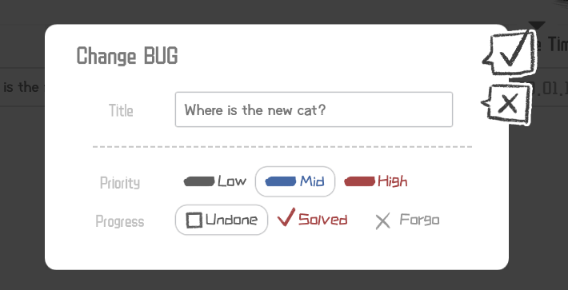

<br/>

**Step 3 : ** Click the [OK] button and the bug will be changed!

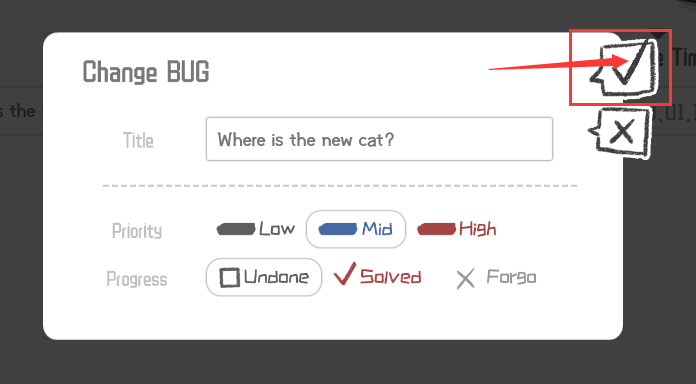

<br/>

```
Note:
When the progress and priority of a bug is changed, two buttons will appear behind the bug.
If you want to know the function of these two buttons, you can check the "Refresh Button & Turn Button" chapter.
```

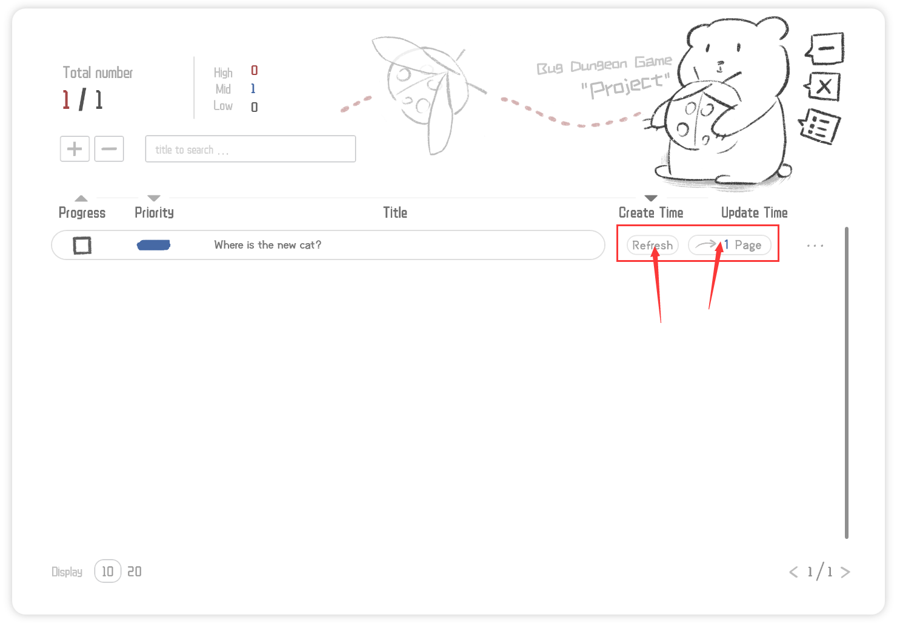

<br/>

<br/>

<br/>

<br/>

## Chat with Bug

In this software, you can "chat" with Bug, and Bug will give you some comfort and encouragement.

```
Chat with Bug, very simple!
 You can type in your thoughts on the bug as if you were chatting with a friend, then the Bug will reply you with its thoughts and encouragement. With friendly chat, your train of thought will be clearer! Isn't it great to debug with chat?
(This feature is inspired by the famous "Rubber Duck Debugging".)
```

```
Note:
We won't get any information from you. 
This software doesn't have any networking features.
See the "Networking" chapter for details.
```

<br/>

**Step 1 : ** Click the [More] button of the bug to enter the [Bug interface]

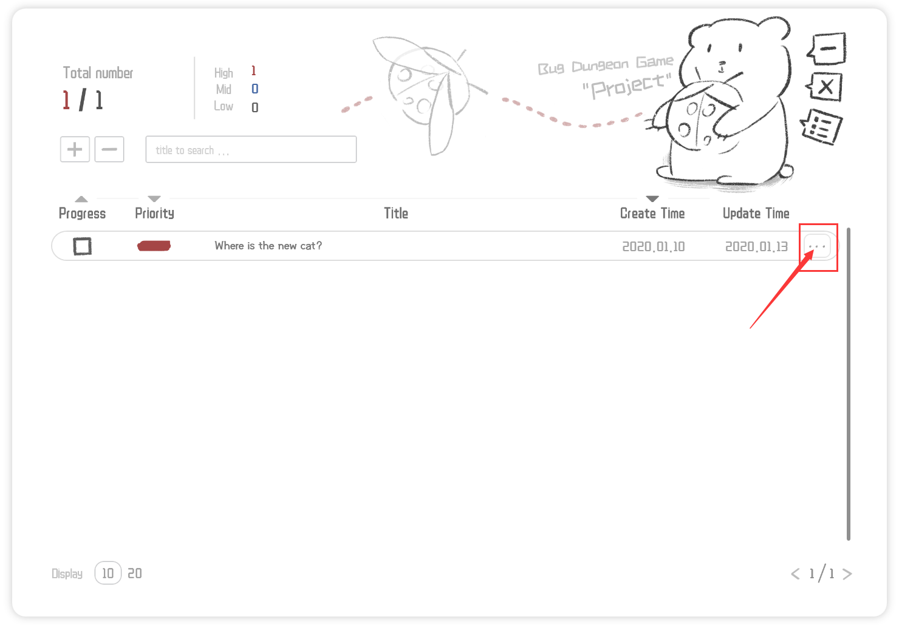

<br/>

**Step 2 : ** Then in the input box, enter what you want to tell the bug, or record some bug information.


<br/>

**Step 3 : ** Click the [Send] button so that the bug can receive what you want to say!


<br/>

**Step 4 : ** Then the bug will reply you!


<br/>

<br/>

<br/>

<br/>

## Save

The software is saved automatically.

```
Note:
Because this software is developed and maintained by individuals.
Therefore, we hope that users can make more backups of project files to prevent accidental loss and damage of project files.
Thank you very much for your understanding.
```

```
Note:
If your project file is corrupted, you can check the "Project File" chapter, maybe there is a way to recover part of the data.
```

<br/>

<br/>

<br/>

<br/>

## Project files

When you create a new project, the software will automatically create a [project folder] for you in the folder you specify.

In this [project folder], there are these things:

| Name              | Description                     |
| ----------------- | ------------------------------- |
| Bug `(folder)`    | All [Bug data] in the project   |
| Image `(folder)`  | All [Image file] in the project |
| Record `(folder)` | All [Chat data] in the project  |
| Backup `(folder)` | [Backup data]                   |
| *.bugs `(File)`   | [Project data]                  |


<br/>

<br/>

### [ Project file is corrupted ]

If your project file is corrupted or data is missing.

You can try to repair the project files using the "Repair Project" tool provided by us.

```
Note: The repair may not be successful. Couldn't repair picture.
```

<br/>

**Step 1 : ** Click the [Settings] button to open the setting interface.


<br/>

**Step 2 : ** Click the [Tool] button in the setting interface to open the Tool.


<br/>

**Step 3: ** Click the [Repair Project] button in the Tool to start repairing the project!


<br/>

```
If you cannot open the Tool, you can download it here:
https://github.com/xujiangjiang/Easy-Bug-Manager-Tool
```

<br/>

<br/>

<br/>

<br/>

## Export Excel file

You can export a project as an Excel file `(.xlsx file) `.

<br/>

**Step 1 : ** Click [Settings] button to open the setting interface


<br/>

**Step 2 : ** Click the [Export as Excel] button

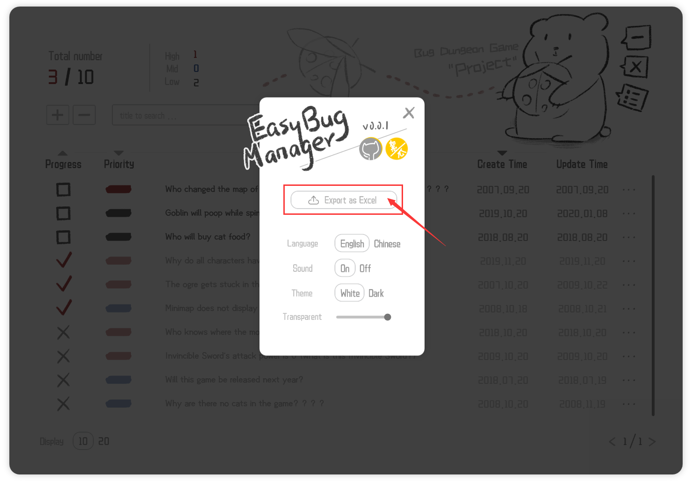

<br/>

**Step 3 : ** Click the [Select Folder] button. Select the folder where you want to save the Excel file.

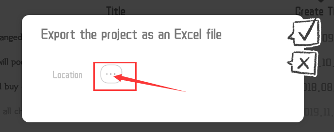

<br/>

**Step 4 : ** After selecting the folder, click the [OK] button. 

​			    The Excel file is successfully exported!


<br/>

**Step 5 : ** The exported Excel file is probably like this!

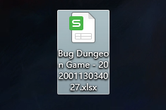


<br/>

<br/>

<br/>

<br/>

## Sort

The software uses **multiple sort**  :

Sorting first considers "progress", 

second considers "priority", 

and third considers "create time" or "update time".

<br/>

<br/>

<br/>

<br/>

## Refresh button & Turn button

When a bug is changed, the bug will stay on the current page temporarily.

```
When you change the progress or priority of a bug, although the bug may no longer belong to this page, for the convenience of operation, the location of the bug will not change for the time being.
```

<br/>

This bug will be temporarily in the state of the following picture:

```
This picture shows that this bug may not belong here, but for convenience, this bug is temporarily displayed here ↓
```

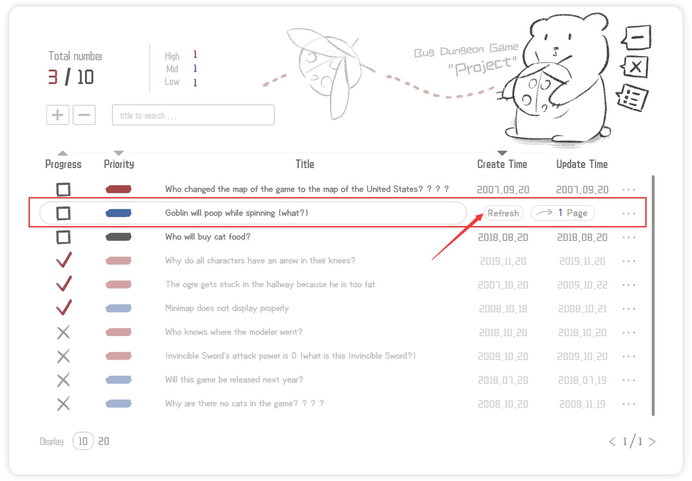

<br/>

<br/>

### [ Refresh button ]

You can click the [Refresh] button to refresh the current page.

```
(All bugs will be reordered)
```


<br/>

<br/>

### [ Turn button ]

You can click the [Turn] button to turn to the page where this bug is located.

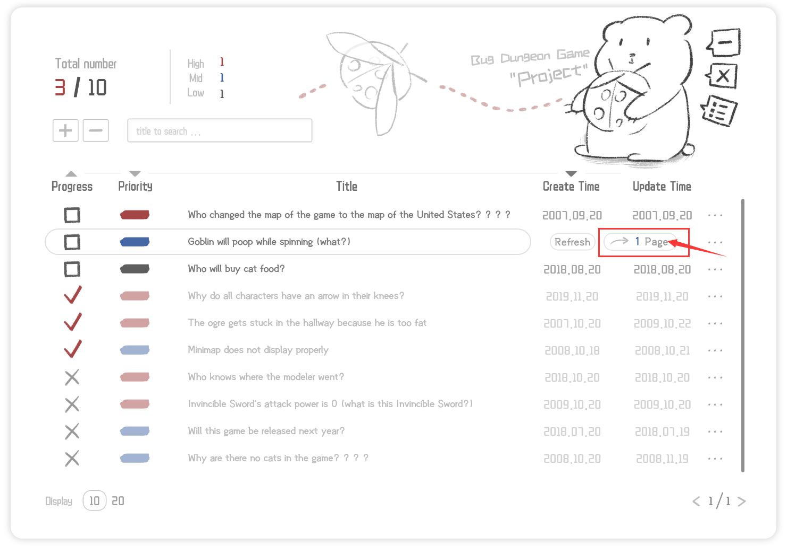

<br/>

<br/>

<br/>

<br/>

## Networking

The entire software does not require networking. This software does not have any servers, and the software is open source, so we cannot get your privacy through this software, please rest assured ~

```
The premise is that you need to download this software on our official website:
https://store.steampowered.com/app/1175080/Easy_Bug_Manager/
https://github.com/xujiangjiang/Easy-Bug-Manager
```

```
note:
If you are using the Steam version, because the software is connected to the Steam platform SDK, Steam may make the software have some networking features.
However, the software itself does not have networking capabilities.
```

<br/>

The software is open-sourced, so you can find the source code on Github.

Github：https://github.com/xujiangjiang/Easy-Bug-Manager

<br/>

<br/>

**In order to better express my meaning, I have kept the original Chinese: **

整个软件都不需要联网，这个软件没有任何的服务器，而且软件是开源的，

所以我们没办法通个这个软件获取到你的隐私，请放心~

```
前提是你需要在我们的官方网站中，下载这个软件：
https://store.steampowered.com/app/1175080/Easy_Bug_Manager/
https://github.com/xujiangjiang/Easy-Bug-Manager
```

```
注意：
如果你使用的是Steam版本，因为软件接入了Steam平台的SDK，因此Steam可能会让软件有些联网功能。
但是，软件本身没有联网的功能。
```

<br/>

这款软件是开源的，因此，你可以在Github网站上找到这款软件的源代码。

Github：https://github.com/xujiangjiang/Easy-Bug-Manager

<br/>

<br/>

<br/>

<br/>

## Sync / Collaborative

Easy Bug Manager software supports third-party version control software.

```
(Eg: Git, TortoiseSVN, GitHub Desktop, Nutstore, etc.)
```

This is a troublesome chapter.
If you are a personal developer, if you only use this software as a todo software, if you do not need collaboration, if you do not understand third-party version control software, then you can skip this chapter.

<br/>

<br/>

### [What is a Collaborative Mode? ]

In order for Easy Bug Manager to support third-party version control software, we must enable Collaborative Mode.

When you open the project and enable the collaborative mode, all changes to the project files will be displayed in the software in real time.

```
Note:
If you enable Collaborative Mode, This software will consume more computer system performance, and more small files will be generated in the project file. 
```

```
Note:
Collaborative Mode is currently in beta test, there may be some defects.Hope you can put up with us more, welcome to give us more suggestions, thank you very much!
```

<br/>

<br/>

### [How to Enable? ]

**Step 1 : ** Click the [Create Project] button to open the Create Project interface.


<br/>

**Step 2 : ** Click the [Advanced Options] button to open the Advanced Options Panel.


<br/>

**Step 3 : ** We check the [Collaborative Mode] option. In this way, this project has become a project that supports Collaborative Mode!


<br/>

**Step 4 : ** When we open this project, the software automatically enables the Collaborative Mode.

```
(When we open a project that supports Collaborative Mode, the software automatically enables the Collaborative Mode.)
(If you see the [Collaborative Mode] button in the upper left corner of the software, it means that the software has enabled the Collaborative Mode.)
```

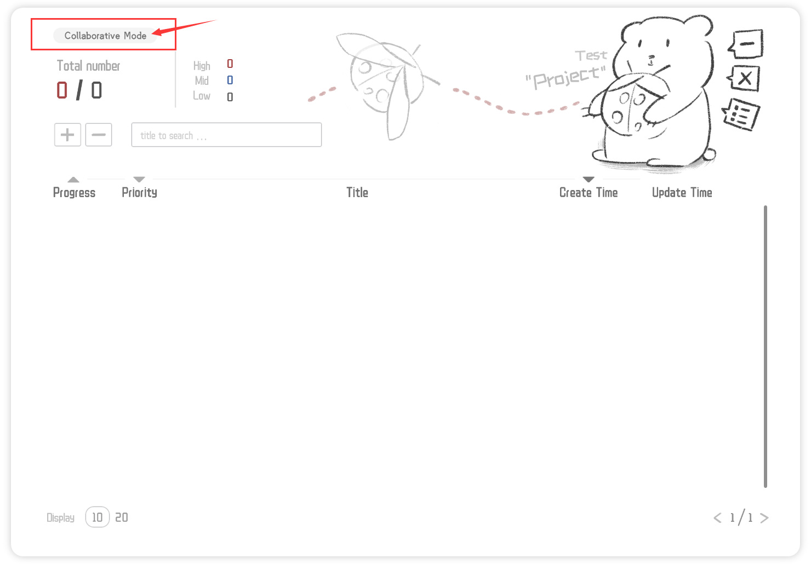

<br/>

<br/>

### [ How to Use? ]

No action is required. When your project file changes, the changes will be automatically displayed in the software.

<br/>

<br/>

### [ How to Close? ]

When you close a project, the Collaborative Mode automatically closes.

<br/>

**Only 1 step : ** Click the [Close] button in the software to close the project, and it will automatically close the Collaborative Mode!

```
You can also close the project by exiting the software directly.
```


<br/>

<br/>

### [ Need Networking?  ]

The entire software does not require networking. This software does not have any servers, and the software is open source, so we cannot get your privacy through this software, please rest assured ~*(For details, please refer to the "Networking" chapter)*

The role of this Collaborative Mode is to support third-party version control software.

```
If you are still not assured, here is the implementation idea of this function:
This functionality is implemented using the .Net FileSystemWatcher class.
The software uses this class to monitor the files in the project. If the files have changed, then we display these changes in the software.
The software will only monitor the current project file and will not monitor other files.
"Monitor" is a feature provided by .Net, which means: if your file changes, it will notify the software.
These functions are all completed in your computer. For more details, you can see the CollaborationSystem.cs file in the source code.
```

<br/>

<br/>

**In order to better express my meaning, I have kept the original Chinese: **

整个软件都不需要联网，这个软件没有任何的服务器，而且软件是开源的，

所以我们没办法通个这个软件获取到你的隐私，请放心~*（具体请看文档的“联网”章节）*

这个协同合作模式仅仅是支持第三方的版本控制软件。

```
如果你还不放心，这里是这个功能的实现思路：
这个功能是用.Net的FileSystemWatcher类实现的。
软件通过这个类，来对项目中的文件进行监测，如果文件发生了更改，那么我们就把这些更改显示在软件中。
软件只会监测当前的项目文件，不会监测其他的文件。
这里说的“监测”是.Net提供的一个功能，意思是：如果你的文件发生了更改，就会通知软件。
这些逻辑都是在你的电脑中完成的，更详细的内容你可以看源代码中的CollaborationSystem.cs文件。
```

<br/>

<br/>

### [ How to convert a Default project into a Collaborative Mode project? (Convert Project) ]

How to convert a Default project into a Collaborative Mode project? Or how to convert a  Collaborative Mode project into an Default project?

You can use the "Convert Project" tool provided by us to convert the project.

<br/>

**Step 1 : ** Click the [Settings] button to open the setting interface.


<br/>

**Step 2 : ** Click the [Tool] button in the setting interface to open the Tool.


<br/>

**Step 3 : ** Click the [Convert Project] button in the Tool to start converting projects!


<br/>

```
If you cannot open the Tool, you can download it here:
https://github.com/xujiangjiang/Easy-Bug-Manager-Tool
```

<br/>

<br/>

<br/>

<br/>

## Language

The software currently supports 2 languages: English and Simplified Chinese.

How do I change the language?

<br/>

**Step 1 : ** Click [Settings] button to open the setting interface


<br/>

**Step 2 : ** Click on the language you want to choose, you can change the language of the software!


<br/>

<br/>

<br/>

<br/>

## Theme

The software comes with 2 themes, light theme and dark theme.

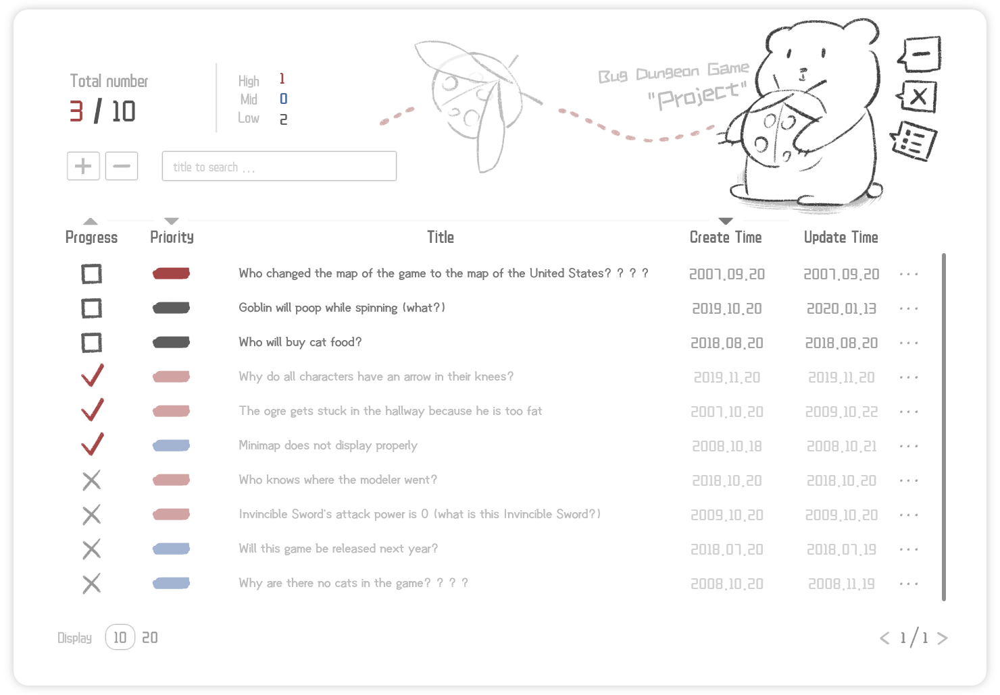


<br/>

<br/>

### [Change theme]

**Step 1 : ** Click [Settings] button to open the setting interface


<br/>

**Step 2 : ** Click the theme you want to choose, you can change the theme of the software!

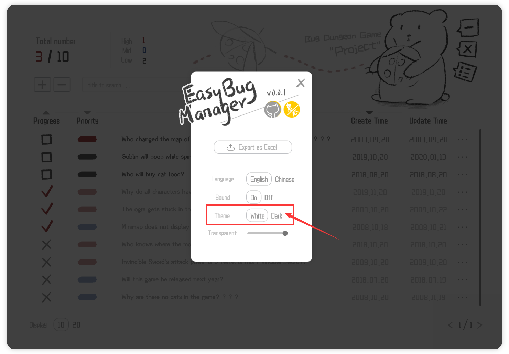

<br/>

<br/>

### [Cat theme]

This software is a small free software.

If you like this software ...

If you want to support the author to continue to maintain this software (and continue to develop new free software) ...

You can buy cat themes for this software.

The cat theme costs $ 1 and includes both light and dark versions.

You can buy it on the Steam Store : https://store.steampowered.com/app/1217970/Easy_Bug_Manager__Cat_Theme/

(Thank you very very very much, thank you very very much!)


<br/>

<br/>

<br/>

<br/>

## Source code

Easy Bug Manager：https://github.com/xujiangjiang/Easy-Bug-Manager

Easy Bug Manager Tool：https://github.com/xujiangjiang/Easy-Bug-Manager-Tool

<br/>

<br/>

<br/>

<br/>

## Creator

<br/>


<br/>

**Design : **XuDaWang、瓜指导

**Art: **XuDaWang

**Program: **XuDaWang

**Thank : **菠萝、mask、小木、布卡、Amir Ammari

**Translator : **Google Translate、grqx、布卡、瓜指导

**Test : **瓜指导、小木、Amir Ammari、胖子于、原浩成、Pw

<br/>

**Font : **站酷庆科黄油体、站酷文艺体、站酷快乐体（https://www.zcool.com.cn/special/zcoolfonts/）

**Epplus：**https://github.com/JanKallman/EPPlus

**Litjson：**https://github.com/LitJSON/litjson

> Thanks for the cool fonts of ZCOOL, and the open source libraries Epplus and Litjson. 

<br/>

<br/>

<br/>