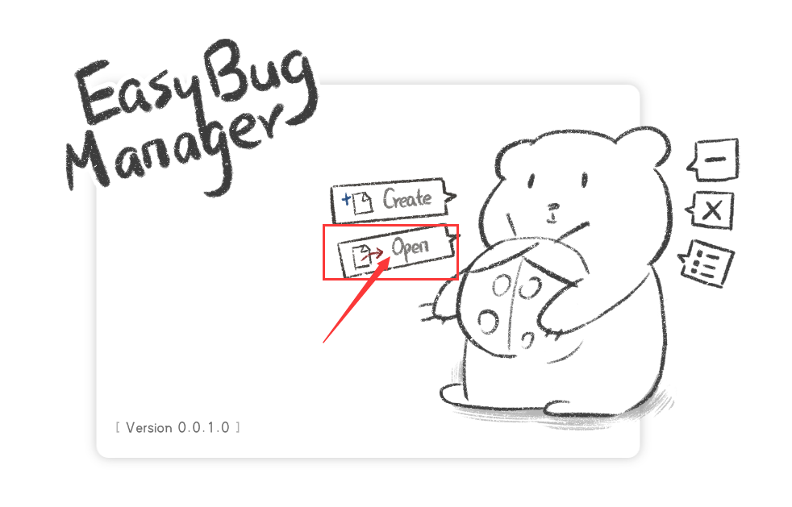
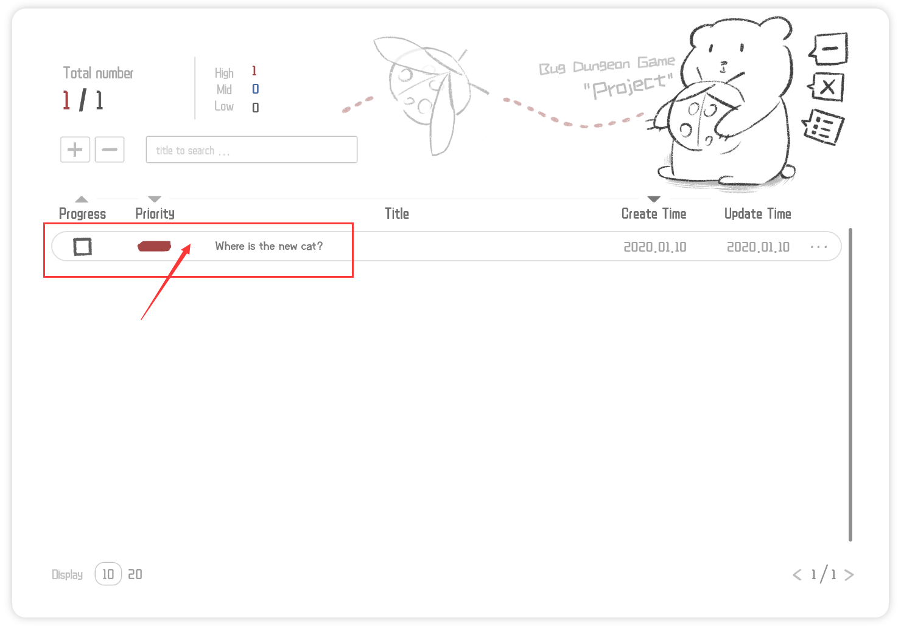
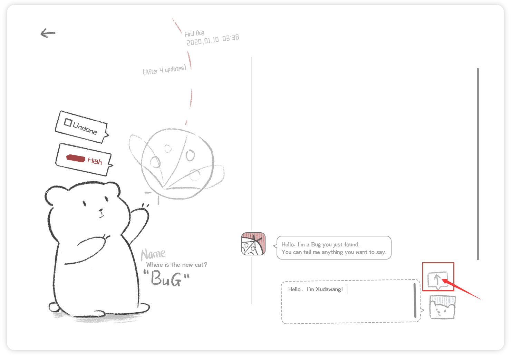
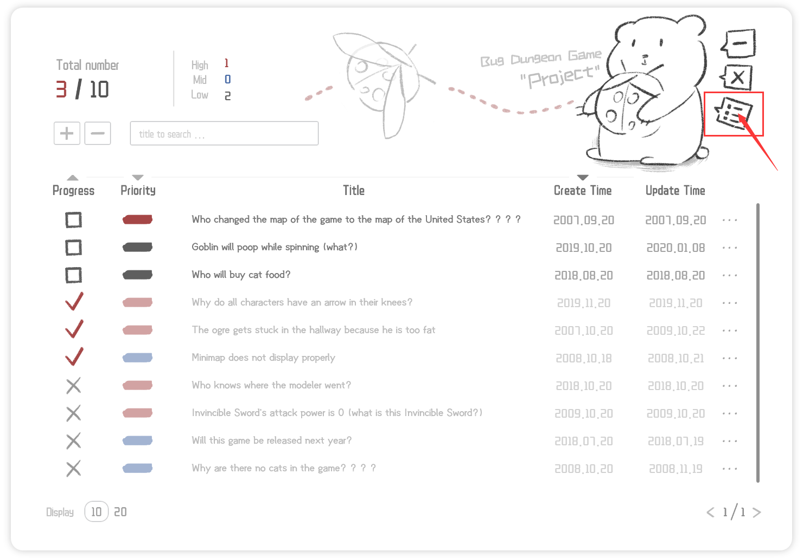
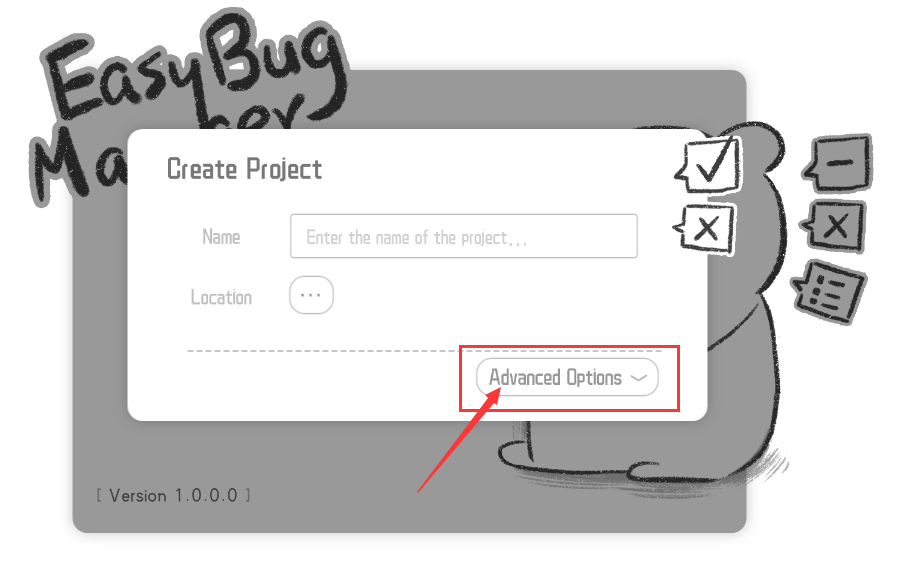
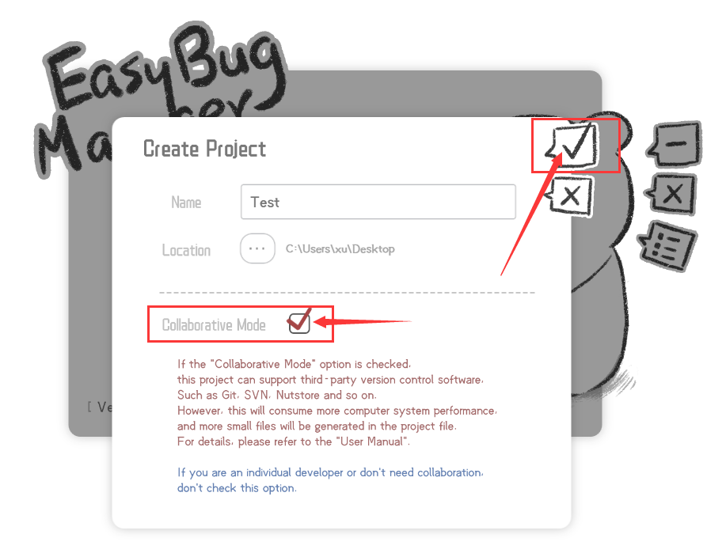
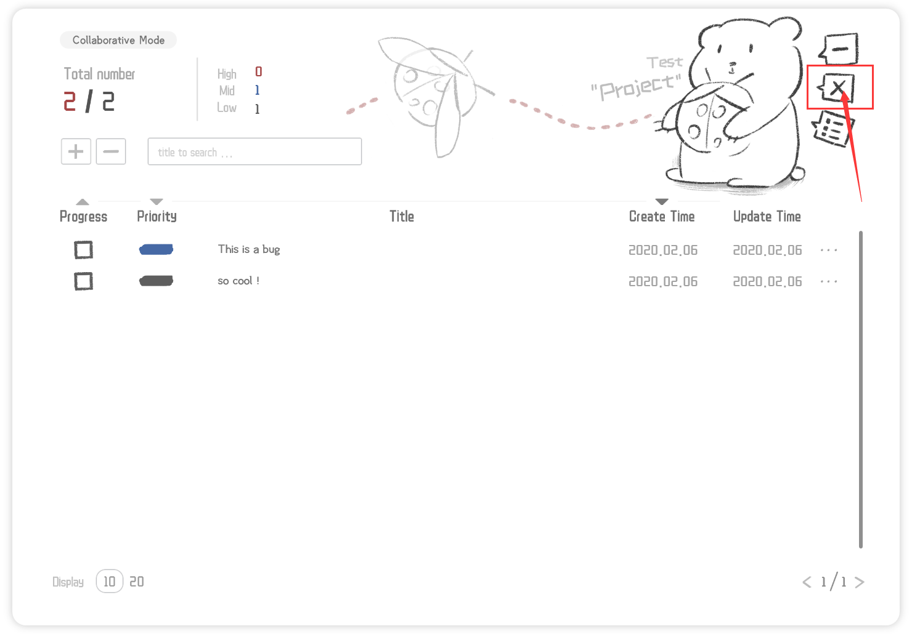
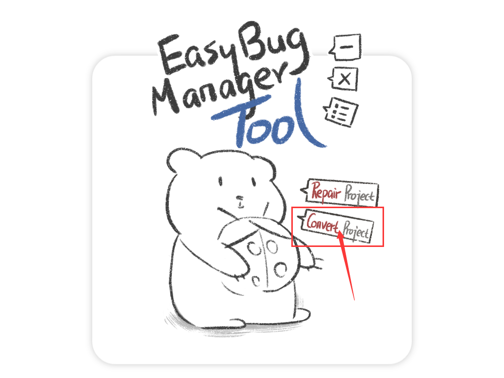

# Easy Bug Manager 用户手册

Time：2020.02.05

By : XuDaWang

<br/>

<br/>

## 前言

<br/>


<br/>

因为这款软件中的大部分工作，是由一个人完成的，因此软件可能存在缺陷，或者有需要改进的地方。

如果你有任何的建议，或者想提交软件中的bug，欢迎通过邮件联系我呀：[xudawang@vip.163.com](xudawang@vip.163.com)

为了让软件能变得更好，我们开源了这款软件，你可以在Github上查看这款软件的源代码：https://github.com/xujiangjiang/Easy-Bug-Manager

感谢你使用这个小软件，非常感谢QAQ！

<br/>

<br/>

<br/>

<br/>

## 目录

[toc]

<br/>

<br/>

<br/>

<br/>

## 下载

Steam商店：https://store.steampowered.com/app/1175080/Easy_Bug_Manager/

Github：https://github.com/xujiangjiang/Easy-Bug-Manager

<br/>

<br/>

<br/>

<br/>

## 简介


<br/>

<u>**介绍**</u>

```
Easy Bug Manager是一款用于管理Bug的工具。
```

如果你正在开发一款软件、网页或游戏，那么你一定要试试这款Easy Bug Manager软件呀，让它来帮助你管理项目中的Bug。
如果你不是一名开发者，你也可以把这款软件当做一个简单可爱的Todo软件来使用呢。它可以帮助你记录和管理要做的事情。
如果你是一位艺术家，你也可以使用这个软件。这个软件可以帮你管理你的想法。

<br/>

<u>**特点**</u>

- 免费
- 导出Excel文件
- 2种皮肤：黑、白
- 2种语言：英文、中文
- 简单、易用
- 可爱、简洁
- 适合个人或者小团队使用
- 内置1只“大白熊”，和你对话，陪你调试Bug（大白熊调试法）

<br/>

<u>**这个软件有什么用？**</u>

记录和管理项目中的Bug。
第1步：输入Bug的描述
第2步：设置Bug的优先级
第3步：然后按照优先级，把Bug一个一个解决掉吧！

<br/>

**<u>如果你是程序员</u>**

你可以把所有的Bug，记录到这个软件里，为每个Bug分配优先级和进度。
这个软件和其他的同类型软件比起来：

- 界面可爱，操作简单。
- 在设计软件的时候，我只保留了真正有用的元素，你不需要填写大量的选项，只需要填写Bug的名字和优先级，就可以创建1个Bug。
- 你不用考虑太多的东西，只需要简单的记录Bug，然后去解决Bug。
- 为了让枯燥的事情变得温暖，我在软件里加入了“大白熊调试法”功能（灵感来源于“小黄鸭调试法”）。你可以像聊天一样，输入你对Bug的看法，Bug会回复你它的想法，以及一些鼓励的话。说不定聊着聊着，你的思路就渐渐清晰啦！以聊天的方式去梳理Bug，是不是超棒呢？

<br/>

**<u>如果你不是程序员</u>**

你可以把这个软件当做一个Todo软件来使用。
第1步：输入要做的事情
第2步：设置事情的优先级
第3步：然后按照优先级，把事情一个一个解决掉吧！
<br/>

**<u>如果你是艺术家</u>**

如果你是一位艺术家，你也可以使用这个软件。这个软件可以帮你管理你的想法。

第1步：输入一个想法
第2步：慢慢补充这个想法
第3步：使用这个想法

<br/>

<br/>

<br/>

<br/>

## 创建项目

一个项目中可以存放很多的Bug。

如果你想管理你的Bug，那么你首先需要创建一个项目文件。

如何才能创建一个项目文件`(.bugs文件)`呢？

<br/>

**第1步：**打开软件后，点击软件中的[创建]按钮。


<br/>

**第2步：**输入项目的名字，并且选择你要把项目文件保存到哪个文件夹中。


<br/>

**第3步：**点击[确认]按钮，一个项目就创建完毕啦！


<br/>

**第4步：**项目创建完毕后，软件会自动打开这个项目。

​			  并且软件会自动在你指定的文件夹中，创建一份项目文件。			

```
 （如果你想了解更多关于“项目文件”的详细内容，可以查看后面的[项目文件]章节）
```

​				

<br/>

<br/>

<br/>

<br/>

## 打开项目

如果你已经有了一个项目文件，那么怎么样才能打开这个项目文件呢？

<br/>

**第1步：**打开软件后，点击软件中的[打开]按钮。



<br/>

**第2步：**然后选择你要打开的项目文件`(.bugs文件)`，然后点击[打开]按钮。


<br/>

**第3步：**软件就会自动打开这个项目啦~


<br/>

<br/>

<br/>

<br/>

## 创建Bug

现在我们的项目里面空空的，我们往里面塞点Bug吧！~

那么怎么才能在项目中创建Bug`（记录一个Bug）`呢？

<br/>

**第1步：**点击界面中的[添加]按钮


<br/>

**第2步：**输入Bug的名字，以及Bug的优先级。


<br/>

**第3步：**点击[确定]按钮


<br/>

**第4步：**这样一个Bug就创建成功啦！


<br/>

<br/>

<br/>

<br/>

## 删除Bug

我们怎么才能删除1个Bug呢？

<br/>

**第1步：**点击要删除的Bug



<br/>

**第2步：**再点击[删除]按钮


<br/>

**第3步：**然后点击[确定删除]按钮，这个Bug就被删除啦！


<br/>

<br/>

<br/>

<br/>

## 修改Bug

你可以随时修改一个Bug的标题、进度、优先级。

*（修改Bug的方式有很多，这里介绍最方便的一种方法）*

<br/>

**第1步：**点击Bug的[进度]按钮


<br/>

**第2步：**对这个Bug进行一些修改


<br/>

**第3步：**点击[确认]按钮，Bug就修改好啦！


<br/>

```
注意：
当一个Bug的进度和优先级被修改后，这条Bug的后面，会多出2个按钮。
如果想了解这2个按钮的作用，可以查看后面的"刷新按钮&跳转按钮"章节。
```


<br/>

<br/>

<br/>

<br/>

## 大白熊调试法

在这个软件中，你可以和Bug进行“聊天”，Bug会给你一些安慰和鼓励。

```
大白熊调试法，非常简单！
你是一只大白熊，你可以和bug进行“交谈”。
输入你的想法，Bug会回复你、鼓励你。一点一点把你的想法说出来，解决Bug的思路也许就会慢慢变得更加清晰。
（“大白熊调试法”的灵感来源于著名的“小黄鸭调试法”。）
```

```
注意：
我们不会获取你输入的任何信息，这款软件没有任何的联网功能。
具体请看后面的“联网”章节。
```

<br/>

**第1步：**点击Bug的[更多]按钮，进入[Bug界面]


<br/>

**第2步：**然后可以在输入框里，输入你想告诉Bug的话，或者是记录一些Bug的信息。


<br/>

**第3步：**点击[发送]按钮，这样Bug就能收到你想说的话啦！



<br/>

**第4步：**然后Bug就会回复你啦！


<br/>

<br/>

<br/>

<br/>

## 保存

软件是自动保存的。

```
注意：
因为这个软件是由个人开发和维护的。
因此，希望用户可以对项目多进行备份。以免软件出错，导致存档丢失、损坏。
非常非常感谢您的理解。
```

```
注意：
如果，你的项目文件损坏了，可以查看后面的“项目文件”章节，也许可以有办法挽回一部分的数据。
```

<br/>

<br/>

<br/>

<br/>

## 项目文件

当你创建1个新的项目时，软件会在你指定的文件夹中，自动帮你创建一个[项目文件夹]。

这个[项目文件夹]中，有这些东西：

| 名字              | 描述                        |
| ----------------- | --------------------------- |
| Bug `(文件夹)`    | 项目中所有的【Bug数据】     |
| Image `(文件夹)`  | 项目中所有的【图片文件】    |
| Record `(文件夹)` | 项目中所有的【聊天数据】    |
| Backup `(文件夹)` | 存放备份的项目数据和Bug数据 |
| *.bugs `(文件)`   | 【项目数据】                |


<br/>

<br/>

### [ 项目文件损坏 ]

如果你的项目文件发生了损坏，或遗失了数据。

你可以尝试用我们提供的“修复项目”工具，对项目文件进行修复。

> 注意：不一定能修复成功。无法修复图片。

<br/>

**第1步：**点击[设置]按钮 ，打开设置界面。


<br/>

**第2步：**点击设置界面中的[Tool]按钮，打开小工具。


<br/>

**第3步：**点击小工具中的[修复项目]按钮，就可以开始对项目进行修复啦！


<br/>

```
如果你无法打开小工具，你可以在这里下载：
https://github.com/xujiangjiang/Easy-Bug-Manager-Tool
```

<br/>

<br/>

<br/>

<br/>

## 导出Excel

你可以把一个项目，导出成一个Excel表格文件(.xlsx文件)。

<br/>

**第1步：**点击[设置]按钮，打开设置界面



<br/>

**第2步：**点击[导出Excel]按钮


<br/>

**第3步：**点击[选择文件夹]按钮。选择要把Excel文件保存到哪个文件夹中。


<br/>

**第4步：**选择好文件夹后，点击[确认]按钮。

​			 这样Excel文件就导出成功啦！


<br/>

**第5步：**导出后的Excel文件，大概是这样哒！


<br/>

<br/>

<br/>

<br/>

## 排序

软件使用的是**多重排序**：

排序优先考虑“完成度”，

然后考虑“优先级”，

最后考虑“创建时间”或“更新时间”。

<br/>

<br/>

<br/>

<br/>

## 刷新按钮&跳转按钮

当一个Bug被修改后，这个Bug会暂时停留在当前页面上。

```
当你修改了一个Bug的进度或优先级后，虽然这个Bug可能已经不属于这一页了，但是为了方便用户的操作，这个Bug的位置暂时不会改变。
```

<br/>

这个Bug会暂时处于这样的状态：

```
这表明这个Bug，可能不属于这里，但是为了方便操作，因此这个Bug暂时显示在这里 ↓
```


<br/>

<br/>

### [ 刷新按钮 ]

你可以点击[刷新]按钮，刷新当前页面。

```
（对所有Bug进行重新排序）
```


<br/>

<br/>

### [ 跳转按钮 ]

你可以点击[跳转]按钮，跳转到这个Bug所在的页面中。


<br/>

<br/>

<br/>

<br/>

## 联网

整个软件都不需要联网，这个软件没有任何的服务器，而且软件是开源的，

所以我们没办法通个这个软件获取到你的隐私，请放心~

```
前提是你需要在我们的官方网站中，下载这个软件：
https://store.steampowered.com/app/1175080/Easy_Bug_Manager/
https://github.com/xujiangjiang/Easy-Bug-Manager
```

```
注意：
如果你使用的是Steam版本，因为软件接入了Steam平台的SDK，因此Steam可能会让软件有些联网功能。
但是，软件本身没有联网的功能。
```

<br/>

这款软件是开源的，因此，你可以在Github网站上找到这款软件的源代码。

Github：https://github.com/xujiangjiang/Easy-Bug-Manager

<br/>

<br/>

<br/>

<br/>

## 同步/协作

Easy Bug Manager软件支持第三方的版本控制软件。

```
（比如：Git、TortoiseSVN、GitHub Desktop、坚果云等）
```

这是个比较麻烦的章节。
如果你是个人开发者，如果你只把这个软件作为一个todo软件来使用，如果你不需要协同合作，如果你不了解第三方版本控制软件，那么你可以不看这部分的内容。

<br/>

<br/>

### [ 什么是协同合作模式？ ]

要让Easy Bug Manager支持第三方的版本控制软件，那么我们必须开启协同合作模式。

当你打开项目，并开启协同合作模式后，所有项目文件的改动，都会实时的显示在软件中。

```
注意：
如果你开启了协同合作模式，软件会更加耗费性能，而且项目文件中会产生更多的小文件。
```

```
注意：
协同合作模式 目前处于测试阶段，可能有很多不完善的地方。希望可以多包容，欢迎邮件给我们建议，非常感谢！
```

<br/>

<br/>

### [ 如何开启？]

**第1步：**点击[创建项目]按钮，打开创建项目界面。


<br/>

**第2步：**点击[高级选项]按钮，打开高级选项面板。



<br/>

**第3步：**我们勾选[协同合作模式]选项，这样一来，这个项目就成为了一个支持协同合作模式的项目啦！



<br/>

**第4步：**我们打开这个项目的时候，软件就自动开启了协同合作模式。

```
（当我们打开支持协同合作的项目时，软件就自动开启了协同合作模式。）
（如果你看到软件的左上角有[协同合作模式]按钮，就代表软件开启了协同合作模式。）
```


<br/>

<br/>

### [ 如何使用？ ]

不需要进行任何操作，当你的项目文件发生变动时，所产生的变动会自动显示在软件中。

<br/>

<br/>

### [ 如何关闭？ ]

当你关闭一个项目的时候，协同合作模式会自动关闭。

<br/>

**只有1步：**点击软件中的[关闭]按钮，就可以关闭项目，同时也会关闭协同合作模式啦！

```
直接退出软件，也可以关闭项目。
```



<br/>

<br/>

### [ 需要联网吗？ ]

整个软件都不需要联网，这个软件没有任何的服务器，而且软件是开源的，

所以我们没办法通个这个软件获取到你的隐私，请放心~*（具体请看文档的“联网”章节）*

这个协同合作模式仅仅是支持第三方的版本控制软件。

```
如果你还不放心，这里是这个功能的实现思路：
这个功能是用.Net的FileSystemWatcher类实现的。
软件通过这个类，来对项目中的文件进行监测，如果文件发生了更改，那么我们就把这些更改显示在软件中。
软件只会监测当前的项目文件，不会监测其他的文件。
这里说的“监测”是.Net提供的一个功能，意思是：如果你的文件发生了更改，就会通知软件。
这些逻辑都是在你的电脑中完成的，更详细的内容你可以看源代码中的CollaborationSystem.cs文件。
```

<br/>

<br/>

### [ 如何把1个普通项目变成协同合作项目？  (转换项目) ]

如何把1个普通项目转换成协同合作项目？或者如何把1个协同合作项目转换成普通项目？

你可以用我们提供的“转换项目”工具，对项目进行转换。

<br/>

**第1步：**点击[设置]按钮 ，打开设置界面。


<br/>

**第2步：**点击设置界面中的[Tool]按钮，打开小工具。


<br/>

**第3步：**点击小工具中的[转换项目]按钮，就可以开始对项目进行转换啦！



<br/>

```
如果你无法打开小工具，你可以在这里下载：
https://github.com/xujiangjiang/Easy-Bug-Manager-Tool
```

<br/>

<br/>

<br/>

<br/>

## 语言

软件目前支持2种语言：英文和简体中文。

如何修改语言呢？

<br/>

**第1步：**点击[设置]按钮，打开设置界面


<br/>

**第2步：**点击你要选择的语言，就可以修改软件的语言啦！


<br/>

<br/>

<br/>

<br/>

## 皮肤

软件自带2个皮肤，白色和黑色皮肤。


<br/>

<br/>

### [ 修改皮肤 ]

**第1步：**点击[设置]按钮，打开设置界面


<br/>

**第2步：**点击你要选择的皮肤，就可以修改软件的皮肤啦！


<br/>

<br/>

### [ 猫咪皮肤 ]

这款软件是一个免费的小软件。

如果你喜欢这个软件……

如果你希望支持一下作者继续维护这款软件（以及继续开发新的免费软件）……

可以购买这个软件的猫咪皮肤。

猫咪皮肤售价1美元，包括了白色版本和黑色版本。

你可以在Steam商店购买：https://store.steampowered.com/app/1217970/Easy_Bug_Manager__Cat_Theme/

（非常非常非常感谢大家，非常非常感谢QAQ！）


<br/>

<br/>

<br/>

<br/>

## 源代码

Easy Bug Manager：https://github.com/xujiangjiang/Easy-Bug-Manager

Easy Bug Manager Tool：https://github.com/xujiangjiang/Easy-Bug-Manager-Tool

<br/>

<br/>

<br/>

<br/>

## 制作者名单

<br/>


<br/>

**设计：**絮大王、瓜指导

**美术：**絮大王

**程序：**絮大王

**感谢：**菠萝、mask、小木、布卡、Amir Ammari

**翻译：**Google Translate、grqx、布卡、瓜指导

**测试：**瓜指导、小木、Amir Ammari、胖子于、原浩成、Pw

<br/>

**字体：**站酷庆科黄油体、站酷文艺体、站酷快乐体（https://www.zcool.com.cn/special/zcoolfonts/）

**Epplus：**https://github.com/JanKallman/EPPlus

**Litjson：**https://github.com/LitJSON/litjson

> 感谢站酷的免费字体，感谢开源类库Epplus和Litjson。

<br/>

<br/>

<br/>

<br/>

## 常见问题

1. **是否可以调整窗口的大小？**

> 可以的。
> 在打开项目之后，鼠标在窗口边缘进行拖拽，就可以调整窗口的大小。

<br/>

<br/>

<br/>